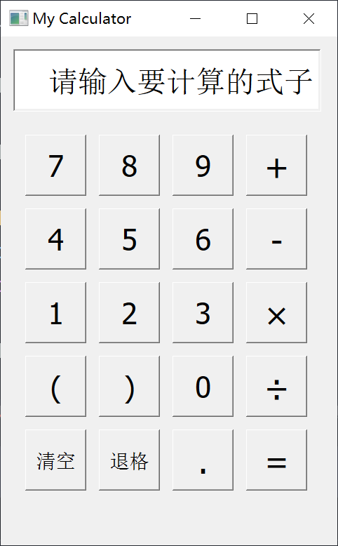
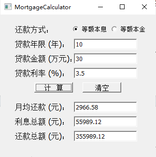
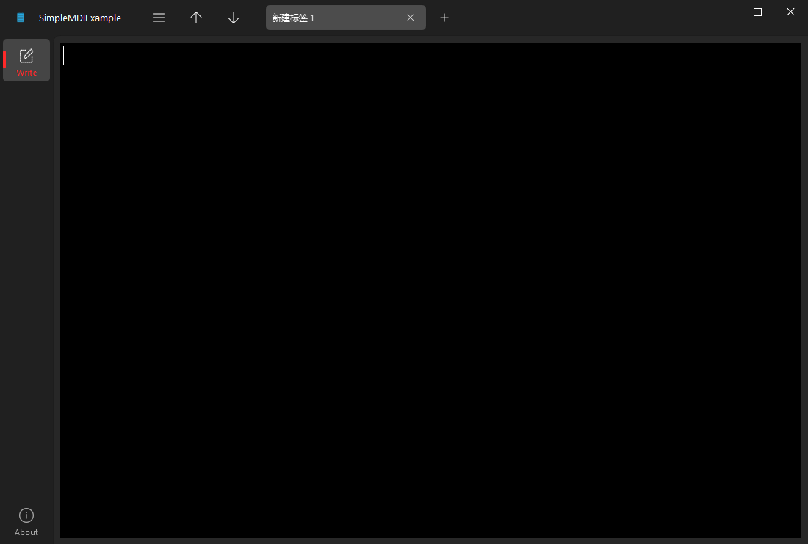

# \[CUMT\] 程序设计综合实践

> [!NOTE]
> 23 级计科学生编写。课程可能已经大幅变动，project 可能有部分不同，甚至全部不同。

CUMT 程序设计综合实践课程 project 代码。包含以下三项 project：

1. 简单计算器
   - 拓展：贷款计算器
3. 拼图游戏
4. 多文档文本编辑器

> [!Tip]
> 程序使用运行库说明：
>
> 1. 简单计算器
>
>    使用 `Qt6` 。本人使用 `Clion` 进行 Qt 开发，故附 [Clion 配置 Qt 开发环境教程](https://blog.csdn.net/theRavensea/article/details/136534197)。~~CSDN 的链接，不要打我~~
>
> 3. 拼图游戏
> 4. 多文档文本编辑器
>
>    使用 `PyQt6` 和 `QFluentWidgets`。附 [QFluentWidgets](https://qfluentwidgets.com/zh/) 官网。

## 程序页面设计预览

**proj01-简单计算器：**

**proj01-简单计算器拓展-贷款计算器：**

**proj02-拼图游戏：**

> 内恰最可爱了！！！

**proj03-多文档文本编辑器：**

